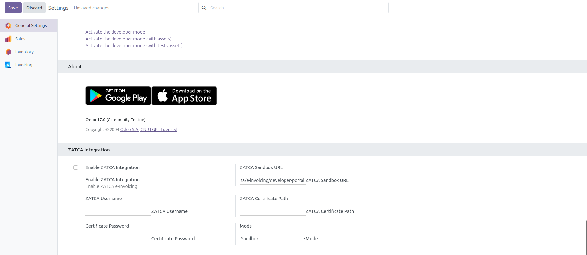
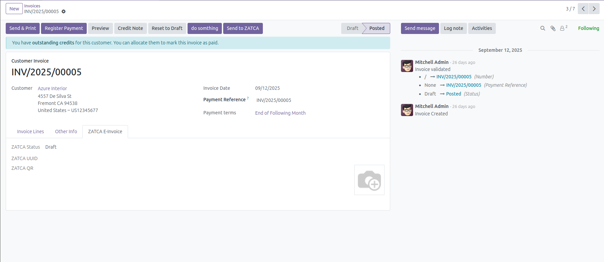
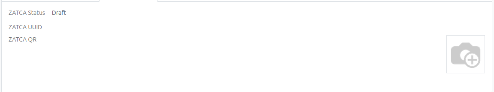

# Odoo 17 ZATCA e-Invoicing Integration

> **A custom Odoo 17 module for integrating e-invoicing with the Saudi ZATCA system.**

---

## Features

- Generate UBL-like XML for customer invoices.
- Digitally sign invoices using a PFX (P12) certificate.
- Send invoices to ZATCA Sandbox or Production endpoints.
- Store and display ZATCA UUID, status, and QR code inside each invoice form.
- Easy configuration via Odoo Settings.

---

## Screenshots

### ZATCA Integration Settings


### Invoice Form with ZATCA Tab


### Invoice ZATCA Tab (Status, UUID, QR Code)


---

## Installation

1. **Copy the module** to your Odoo addons directory.
2. **Install required Python packages:**
   ```bash
   pip install lxml signxml cryptography qrcode requests
   ```
3. **Update Apps List** in Odoo and install the module.

---

## Configuration

1. Go to **Settings > General Settings > ZATCA Integration**.
2. Enable integration, select mode (Sandbox/Production).
3. Enter Sandbox URL, Username.
4. Upload your ZATCA certificate file (.p12/.pfx).
5. Enter certificate password.

---

## Usage

- Open any customer invoice.
- Click **Send to ZATCA** in the invoice form.
- Check the **ZATCA E-Invoice** tab for status, UUID, and QR code.

---

## Development & Testing

- Test integration using ZATCA Sandbox credentials.
- For production usage, use a real ZATCA certificate and endpoint.

---

## License

This module is licensed under the MIT License.

---

## Contact

Developed by [Your Name](https://github.com/USERNAME)

---
